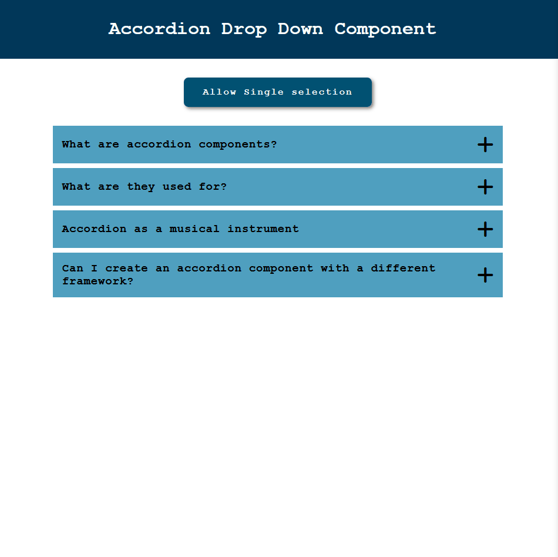

# Accordion Dropdown

# Components

## Questions

In this section, the data (an array of objects representing each question-answer pair) is processed using the JavaScript `map` function and then passed as props to the `Accordion` component.  

Two state variables are created: **isSingleSelection** (a boolean) and **selected** (a string representing a number).  

- `isSingleSelection` determines whether the accordion operates in single or multi-selection mode.  
- `selected` is used in single-selection mode to track which question-answer box should remain open.  

## Accordion

Inside the `Accordion` component, the props are received and used to populate the question-answer boxes.  

Functions are defined to handle the opening and closing of these boxes:  

- **`handleAccordionMulti()`** manages multi-selection behavior.  
- **`handleAccordionSingle()`** manages single-selection behavior.

These functions are conditionally executed based on the `isSingleSelection` prop within a wrapper function called **`handleAccordion`**.  

Additionally, the `useEffect` hook is used to reset the `isExpanded` and `isSelected` states. This ensures that the `+` and `-` icons render correctly without being affected by the previous `isSingleSelection` state.  
