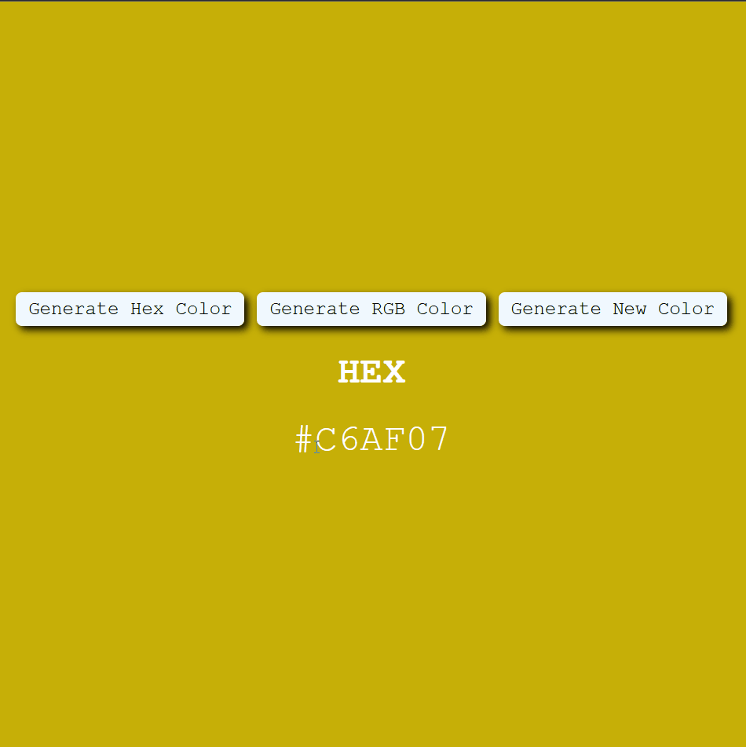

# Random Color Generator

## Functions

- **`generateHexColor()`**: Returns a string representing a HEX color value.  
- **`generateRGBColor()`**: Returns a string representing an RGB color value.  
- **`handleHexColorChange()`**:  
  - Sets the `isHex` state to `true`.  
  - Updates the `color` state with a new HEX color.  
  - The second step ensures that the user can generate a new HEX color even if `isHex` is already `true`. Without this, clicking the same button repeatedly would not trigger a color change, as React state updates only when there is an actual change in value.  
- **`handleRGBColorChange()`**:  
  - Sets the `isHex` state to `false`.  
  - Updates the `color` state with a new RGB color.  
  - Works similarly to `handleHexColorChange()`, ensuring a new color is generated even if `isHex` is already `false`.  

## `useEffect` Hook  

The `useEffect` hook ensures that the background color updates correctly whenever the `isHex` state changes.  

### Why is `useEffect` necessary?  

In React, **state updates are asynchronous**, meaning that when calling `setIsHex(true)` or `setIsHex(false)`, the value of `isHex` **does not change immediately** within the same function execution.  

Since the color update relies on the **current** value of `isHex` inside `handleHexColorChange()` and `handleRGBColorChange()`, it still holds the **previous** value. This causes the function to generate a color using the outdated format.

### How `useEffect` fixes this issue  

By using `useEffect`, we ensure that the color updates **whenever `isHex` changes**, without relying on outdated state values.